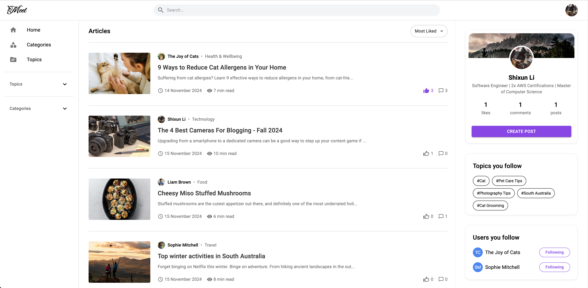

<div align="center">
  <h1>
    Meet Community
  </h1>
  
  <h3>
    <a href="https://meet-community.top">Visit Meet</a>
	</h3>
</div>


## About the Project

Meet is an open-source blogging and life-sharing community where people can connect and engage with one another. Powered by robust features and deployed on AWS, it integrates a reliable Java Spring Boot backend with an engaging React frontend. Visit our site and register today to start your journey!


### Our Features

- Secured Login/Sign up
- Third-party login (e.g., GitHub)
- Forgot Password Recovery
- "Remember Me" Functionality
- Rich Text Blog Posting
- Blog Search and Sorting
- Upvote blogs
- Comment on Blogs and Replies
- Follow/Unfollow Categories, Topics, or Users
- Profile Banner and Avatar Upload
- Personal Information Updates


### Test account

if you don't want to become a Meet member, feel free to login as a demo user to explore the features with a real account.

**Username**: Test

**Password**: 112233


### Tech Stack

<details>
  <summary>Frontend</summary>
  <ul style="font-size:14px">
    <li>React</li>
    <li>JavaScript</li>
    <li>Axios</li>
    <li>Material UI</li>
    <li>Tailwind CSS</li>
  </ul>
</details>

<details>
  <summary>Backend</summary>
  <ul style="font-size:14px">
    <li>Spring Boot</li>
    <li>Spring Security</li>
    <li>JWT</li>
    <li>OAuth2</li>
    <li>JPA</li>
    <li>Swagger</li>
    <li>Junit Test</li>
  </ul>
</details>


<details>
  <summary>Database</summary>
  <ul style="font-size:14px">
    <li>Postgres</li>
  </ul>
</details>
<details>
  <summary>DevOps</summary>
  <ul style="font-size:14px">
    <li>Docker</li>
    <li>Docker-compose</li>
    <li>AWS</li>
  </ul>
</details>


## Getting Start

### Local Deployment

Before starting the deployment, ensure that [Docker](https://www.docker.com/) is installed on your system.

To start your local deployment, run the following line:

```bash
docker compose up --build
```

Now, you can access the Meet via [http://localhost:5173/](), and explore API endpoints via [http://localhost:8080/swagger-ui/index.html]().


To stop your local deployment, simply run the following line:

```bash
docker compose down
```


### Test

You can also run the whole unit tests at `Meet/backend/src/test/java/backend/`


## Screenshot

**Home page**




**Login**


**Create A New Post**


**Blog page**


**Profile page**


**Forgot Password**


## License

[MIT License](LICENSE)
